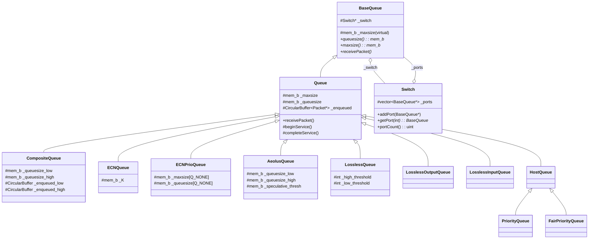
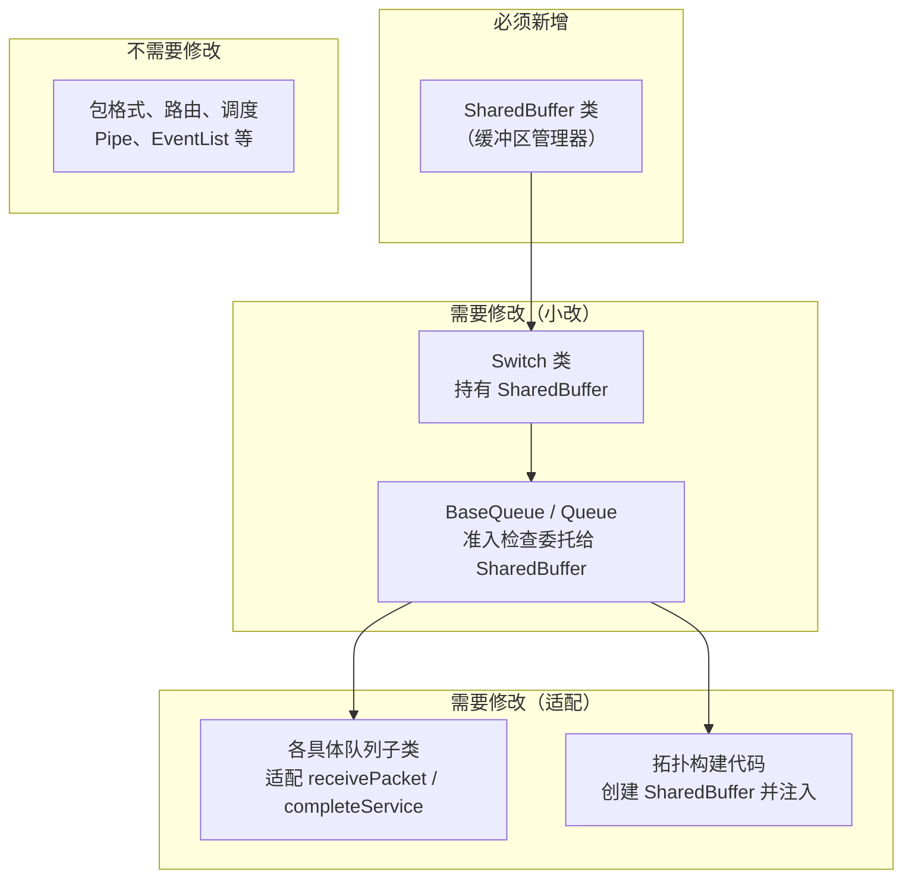
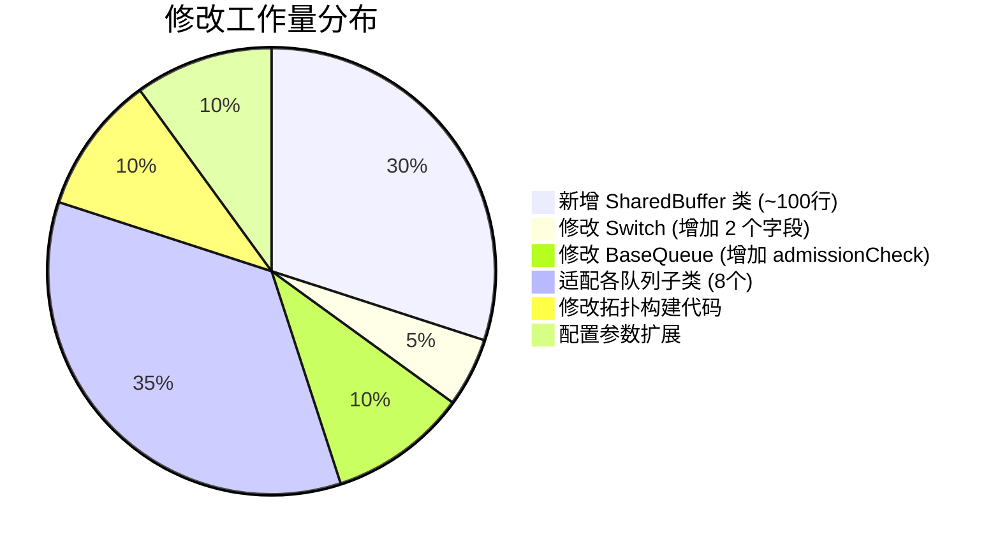

# 共享缓冲区（Shared Buffer）实现可行性 — 第一性原理分析

> 分析目标：从代码结构的"底层事实"出发，推导出在当前 htsim 交换机/队列架构上实现共享缓冲区的最优路径与实际影响面。

---

## 1. 当前架构现状

### 1.1 核心类继承关系



### 1.2 缓冲区模型的三个事实

| # | 事实 | 代码证据 |
|---|------|----------|
| **F1** | 每个队列拥有**独立的** `_maxsize` | `Queue` 构造函数接收 `mem_b maxsize` 参数，赋值给 `_maxsize`；`ECNPrioQueue` 甚至有 `_maxsize[Q_NONE]` 数组为每个优先级独立设限 |
| **F2** | 入队检查是**本地判断** | `Queue::receivePacket` 中 `if (_queuesize + pkt.size() > _maxsize)` 只看自身状态，不查询 Switch 或其他队列 |
| **F3** | Switch **不参与**缓冲管理 | `Switch` 仅持有 `vector<BaseQueue*> _ports`，职責是端口注册、PAUSE 帧广播、路由查表。**没有任何缓冲区总量跟踪变量**，`addPort()` 只做 `push_back` |

> [!IMPORTANT]
> 结论：当前是典型的 **Static Per-Queue Buffer** 模型 — 每个队列的缓冲区空间在创建时就被静态分配，运行时互相隔离、互不影响。

---

## 2. 共享缓冲区的本质需求

在真实交换机中，共享缓冲区（如 Memory Management Unit, MMU）的核心机制是：

```
多个队列共享一个总缓冲池（Shared Pool）
├── 每个队列有最小保证空间（Min Guaranteed / Reserved）
├── 超出保证空间的部分从共享池中动态分配
├── 准入控制依赖全局状态（如剩余共享空间、Dynamic Threshold α）
└── 当共享池耗尽时，即使单个队列未满也可能触发丢包
```

**关键差异点**：准入决策从"本地 `_queuesize < _maxsize`"变为"全局 `shared_pool_remaining > 0` 且满足动态阈值"。

---

## 3. 第一性原理分析：需要改什么？

### 3.1 回到最基本的问题

实现共享缓冲区，本质上只需要回答一个问题：

> **当一个包到达某个队列时，如何决定是否准入？**

当前答案：`_queuesize + pkt.size() > _maxsize` → 丢弃（仅看自己）

共享缓冲区答案：询问一个**交换机级别的共享资源管理器**是否允许分配空间 → 若不允许则丢弃

因此，需要改动的本质是：**在准入检查环节引入一个全局协调者**。

### 3.2 改动影响面推导

从这个本质出发，逐层推导需要变更的内容：



---

## 4. 具体方案设计

### 4.1 新增组件：`SharedBuffer` 类

```cpp
// shared_buffer.h  [NEW]
class SharedBuffer {
public:
    SharedBuffer(mem_b total_pool_size);
    
    // 核心接口：请求/释放共享空间
    bool try_allocate(mem_b bytes, BaseQueue* requester);
    void release(mem_b bytes, BaseQueue* requester);
    
    // 查询接口
    mem_b remaining() const;
    mem_b total_used() const;
    mem_b queue_usage(BaseQueue* q) const;  // 可选：per-queue 跟踪
    
private:
    mem_b _total_pool;         // 总共享池大小
    mem_b _used;               // 当前已使用
    // 可选：Dynamic Threshold 参数
    double _alpha;             // α 系数（动态阈值算法）
};
```

> [!TIP]
> `SharedBuffer` 可以支持多种缓冲区管理策略：
> - **Static Threshold**（固定上限）：最简单
> - **Dynamic Threshold (DT)**（如 Memory Management Unit 中的 α 算法）：`threshold(q) = α × remaining_shared`
> - **完全共享**：无限制，仅看总量

### 4.2 修改 Switch：持有 SharedBuffer

```diff
 class Switch : public EventSource, public Drawable, public PacketSink {
+public:
+    SharedBuffer* getSharedBuffer() { return _shared_buffer; }
+    void setSharedBuffer(SharedBuffer* sb) { _shared_buffer = sb; }
 protected:
     vector<BaseQueue*> _ports;
+    SharedBuffer* _shared_buffer = nullptr;  // 可选，为 nullptr 时退化为独立缓冲模式
 };
```

### 4.3 修改队列准入逻辑（关键点）

**核心洞察**：不需要修改每个队列子类的全部逻辑，只需要修改"准入检查"这一个环节。

#### 方案 A：在 BaseQueue 中加入共享缓冲区感知（推荐，最小改动）

```diff
 // queue.h - BaseQueue 新增
+    // 检查是否允许入队（考虑共享缓冲区）
+    virtual bool admissionCheck(mem_b pkt_size);
```

```cpp
// queue.cpp - 默认实现
bool BaseQueue::admissionCheck(mem_b pkt_size) {
    if (_switch && _switch->getSharedBuffer()) {
        return _switch->getSharedBuffer()->try_allocate(pkt_size, this);
    }
    // 退化为传统独立缓冲区检查
    return (queuesize() + pkt_size) <= maxsize();
}
```

然后将各队列的 `receivePacket` 中的入队检查改为调用 `admissionCheck`：

```diff
 // Queue::receivePacket
 void Queue::receivePacket(Packet& pkt) {
-    if (_queuesize + pkt.size() > _maxsize) {
+    if (!admissionCheck(pkt.size())) {
         // drop
     }
 }
```

同理，在 `completeService` 中释放空间时通知 SharedBuffer：

```diff
 void Queue::completeService() {
     Packet* pkt = _enqueued.pop();
     _queuesize -= pkt->size();
+    if (_switch && _switch->getSharedBuffer()) {
+        _switch->getSharedBuffer()->release(pkt->size(), this);
+    }
     ...
 }
```

#### 方案 B：通过新的队列子类实现（可选，零侵入）

如果不想修改已有队列代码，可以创建自带共享缓冲区支持的队列子类：

```cpp
// shared_buffer_queue.h  [NEW]
class SharedBufferQueue : public Queue {
public:
    SharedBufferQueue(linkspeed_bps bitrate, mem_b reserved_size,
                      EventList& eventlist, QueueLogger* logger,
                      SharedBuffer* shared_buffer);
    void receivePacket(Packet& pkt) override;
    void completeService() override;
private:
    SharedBuffer* _shared_buffer;
    mem_b _reserved;  // 最小保证空间
};
```

### 4.4 各队列子类的适配工作量

| 队列类 | 准入检查位置 | 适配难度 | 说明 |
|---------|-------------|---------|------|
| [Queue](file:///home/wy/Code/uet-htsim/htsim/sim/src/components/queue.cpp#L170-L198) | `receivePacket` L172 | ⭐ 简单 | 单点改 `_queuesize+pkt.size() > _maxsize` |
| [ECNQueue](file:///home/wy/Code/uet-htsim/htsim/sim/src/components/ecnqueue.cpp#L17-L78) | `receivePacket` L49 | ⭐ 简单 | 同上，另需保持 ECN 标记逻辑不变 |
| [CompositeQueue](file:///home/wy/Code/uet-htsim/htsim/sim/src/components/compositequeue.cpp#L150-L314) | `receivePacket` 多处检查 | ⭐⭐ 中等 | 有 low/high 两个子队列，需分别适配 |
| [AeolusQueue](file:///home/wy/Code/uet-htsim/htsim/sim/src/components/aeolusqueue.h) | `receivePacket` | ⭐⭐ 中等 | 有 speculative threshold，需保持语义 |
| [ECNPrioQueue](file:///home/wy/Code/uet-htsim/htsim/sim/src/components/ecnprioqueue.h) | `receivePacket` | ⭐⭐ 中等 | 每个优先级有独立 `_maxsize[]`，需决定哪些共享 |
| [LosslessQueue](file:///home/wy/Code/uet-htsim/htsim/sim/src/components/queue_lossless.cpp#L40-L101) | `receivePacket` (无丢包) | ⭐⭐⭐ 需注意 | 无损队列不丢包，但 PAUSE 阈值可与共享池关联 |
| [LosslessOutputQueue](file:///home/wy/Code/uet-htsim/htsim/sim/src/components/queue_lossless_output.h) | `receivePacket` | ⭐⭐ 中等 | 类似 LosslessQueue |
| [PriorityQueue](file:///home/wy/Code/uet-htsim/htsim/sim/src/components/queue.h#L133-L155) | `receivePacket` L258 | ⭐ 简单 | 虽有优先级但共享同一个 `_maxsize` |
| [FairPriorityQueue](file:///home/wy/Code/uet-htsim/htsim/sim/src/components/queue.h#L159-L184) | `receivePacket` L434 | ⭐ 简单 | 同 PriorityQueue |

### 4.5 拓扑构建代码的修改

在 [fat_tree_topology.cpp](file:///home/wy/Code/uet-htsim/htsim/sim/datacenter/topologies/fat_tree_topology.cpp) 的 `FatTreeTopology` 构造函数中：

```diff
 // 创建 Switch 时
 for (uint32_t j = 0; j < _cfg->NTOR; j++) {
     switches_lp[j] = new FatTreeSwitch(...);
+    // 为每个交换机创建共享缓冲区
+    switches_lp[j]->setSharedBuffer(
+        new SharedBuffer(total_shared_pool_size));
 }
```

---

## 5. 关键结论：是否需要"大改"？

### 5.1 影响面全景



### 5.2 核心判断

> [!IMPORTANT]
> **不需要大改，也不需要把所有队列"通通修改一遍"。**

| 问题 | 回答 |
|------|------|
| 需要把所有队列全部重写吗？ | **不需要**。只需修改各队列 `receivePacket` 中的准入检查（通常是 1-2 行），以及 `completeService` 中加入释放通知（1 行） |
| 是否要修改包/路由/调度等模块？ | **不需要**。共享缓冲区仅影响入队准入决策，不影响包的格式、路由选择、事件调度 |
| 能否以最小代价实现？ | **可以**。最小路径是方案 A，利用 `BaseQueue::admissionCheck` 虚函数封装判断逻辑，各子类调用统一接口 |
| 是否可以渐进式实施？ | **可以**。SharedBuffer 为 `nullptr` 时退化为当前独立缓冲模式，可以逐个队列类型启用 |
| 是否需要实现全新的队列组件？ | **可选但非必须**。方案 B（新建子类）可实现零侵入，但会有更多代码重复 |

### 5.3 推荐实施顺序

```
Phase 1 — 基础设施（~100 行新代码）
  ├─ 新建 SharedBuffer 类
  ├─ 修改 Switch 持有 SharedBuffer
  └─ 在 BaseQueue 中增加 admissionCheck 虚函数

Phase 2 — 适配最常用队列类型（选择性改动）
  ├─ Queue（基础 FIFO）
  ├─ CompositeQueue（NDP 使用）
  └─ ECNQueue（DCTCP 使用）

Phase 3 — 扩展到所有队列类型
  ├─ AeolusQueue、ECNPrioQueue
  └─ LosslessQueue（若需支持 PFC 场景下的共享缓冲）

Phase 4 — 高级功能
  ├─ Dynamic Threshold (α 算法)
  ├─ Per-priority 保证空间
  └─ 缓冲区使用统计 / 日志
```

---

## 6. 风险与注意事项

> [!WARNING]
> **并发安全**：htsim 是事件驱动的单线程模拟器，不存在真正的并发问题。但要注意在同一个事件处理中，一个包可能触发另一个队列的操作（如 PAUSE 帧），需确保 SharedBuffer 的 allocate/release 调用顺序正确。

> [!CAUTION]
> **向后兼容**：修改 `Queue::receivePacket` 会影响所有从 `Queue` 继承且未覆盖 `receivePacket` 的类。需通过 `nullptr` 检查保证当不使用 SharedBuffer 时行为不变。

| 风险项 | 影响 | 缓解措施 |
|--------|------|---------|
| `LosslessQueue` 不丢包，与共享缓冲区冲突 | 中 | 对 LosslessQueue 可将共享缓冲区用于 PAUSE 阈值计算，而非丢包判断 |
| ECN 标记阈值需要与共享池关联 | 低 | ECN 阈值可改为 `min(per_queue_thresh, shared_pool_based_thresh)` |
| 日志系统需感知共享缓冲区 | 低 | 在 `MultiQueueLoggerSampling` 中增加总共享池使用量的记录 |
| 现有实验配置需要扩展 | 低 | 增加 `shared_buffer_size`、`alpha` 等配置参数 |

---

## 7. 总结

**从第一性原理来看**，当前架构中缓冲区管理的"决策点"高度集中在各队列的 `receivePacket` 方法中，而这些方法的判断逻辑可以被统一抽象为 `admissionCheck()` 虚函数。这个架构特点使得引入共享缓冲区变成了一个**"在决策点引入全局协调者"**的问题，而非需要重构整个数据通路的任务。

**最终结论**：**小改即可**。新增一个 `SharedBuffer` 管理类 + 在 `Switch` 和 `BaseQueue` 层面各加几行代码 + 在各队列子类中将准入检查委托给统一接口，就能以最小代价实现共享缓冲区功能，且完全向后兼容。
